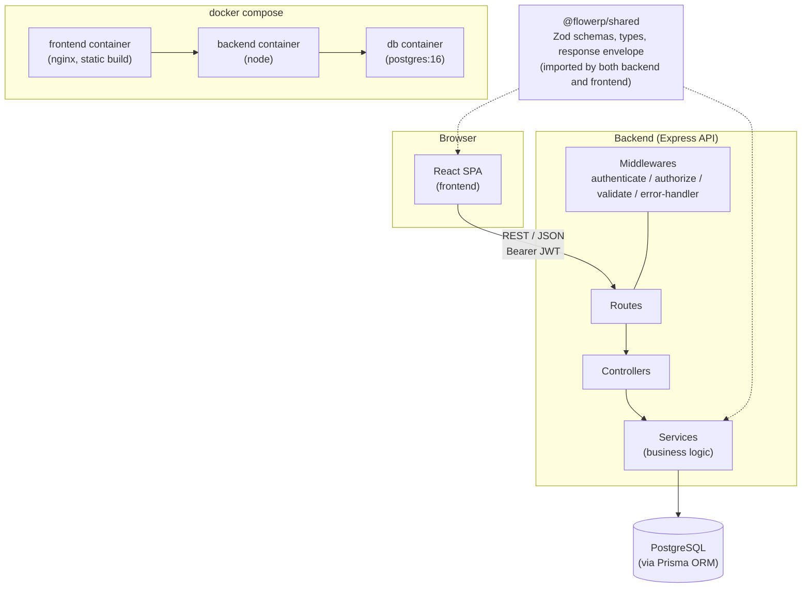
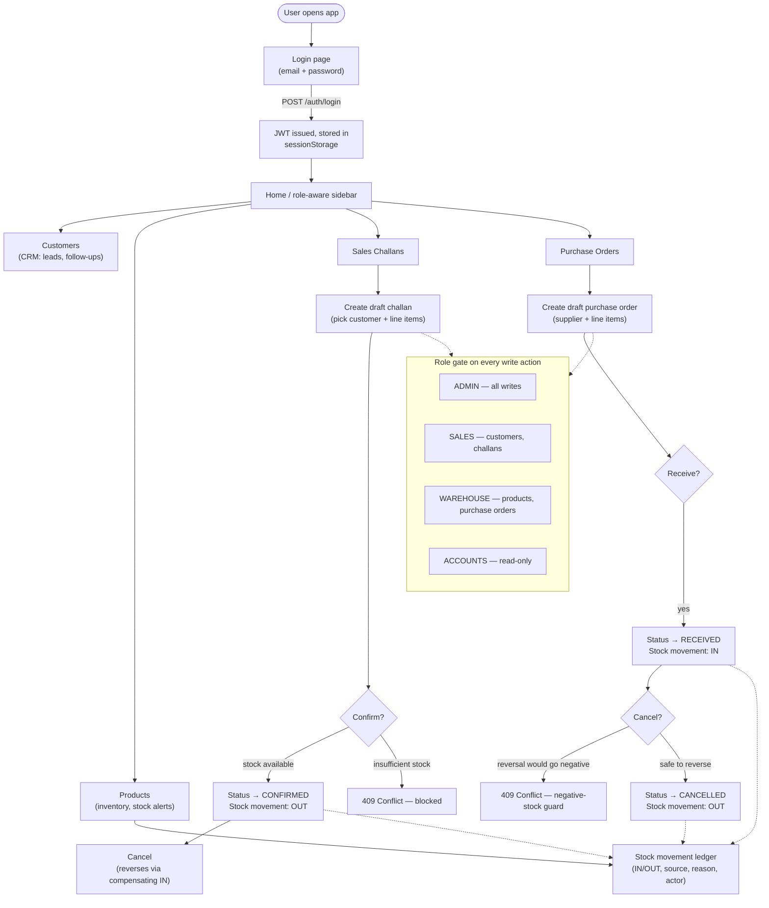

# FlowERP

A mini ERP + CRM operations portal for a wholesale/distribution business — customers, product inventory, sales challans, and purchase orders in one role-based web application.

## Project Description

FlowERP is a full-stack, TypeScript monorepo that models the day-to-day operations of a small wholesale/distribution company: tracking customers and follow-ups, maintaining product stock levels, issuing sales challans against inventory, and raising purchase orders to replenish it. Every stock-affecting action (confirming a challan, receiving or cancelling a purchase order) is reconciled through a single, auditable stock-movement ledger, and access to write actions is restricted by user role.

The project was built module-by-module against a set of numbered specs (`FLO-001` through `FLO-025`), progressing from monorepo bootstrap → backend/frontend scaffolding → database schema → authentication/RBAC → each business module (customers, products, stock movements, sales challans, purchase orders) → environment/config hardening → Docker Compose → CI → API documentation.

## Live Demo

## Deployed on an AWS EC2 instance:

| Resource | Link |
| --- | --- |
| Frontend | [flowerp.samridhhi.space](https://flowerp.samridhhi.space/) |
| Backend API | [flowerp-api.samridhhi.space](https://flowerp-api.samridhhi.space/) |
| Postman Collection | [docs/postman_collection.json](docs/postman_collection.json) |

Log in with any of the seeded demo accounts below to explore the role-based behavior (all four accounts share the same password):

| Role | Email | Password |
| --- | --- | --- |
| Admin | `admin@flowerp.test` | `FlowERP123!` |
| Sales | `sales@flowerp.test` | `FlowERP123!` |
| Warehouse | `warehouse@flowerp.test` | `FlowERP123!` |
| Accounts | `accounts@flowerp.test` | `FlowERP123!` |

These are non-production, publishable test credentials seeded by `prisma/seed.ts` — never real secrets. Each role sees the same read access but different write permissions (see [Features](#features) and the RBAC gate in the [user flow](#user-flow) below).

## Tech Stack

**Backend**
- Node.js (20.19.0) + TypeScript
- Express 5
- PostgreSQL + Prisma ORM (schema split by business domain under `prisma/schema/`)
- Zod (request validation and shared schemas)
- JWT (`jsonwebtoken`) for authentication, `bcrypt` for password hashing
- Vitest + Supertest for unit/integration testing

**Frontend**
- React 19 + TypeScript
- Vite
- Tailwind CSS 4
- React Router 7
- TanStack Query (server-state/data fetching)
- React Hook Form + `@hookform/resolvers` (Zod-validated forms)
- Vitest + React Testing Library

**Shared / Tooling**
- `packages/shared` — Zod schemas and types shared between backend and frontend
- npm workspaces (monorepo)
- ESLint + Prettier, Husky + lint-staged (pre-commit)
- GitHub Actions (CI)
- Docker + Docker Compose

## High-Level Architecture



**Monorepo layout** (npm workspaces):

| Workspace | Responsibility |
| --- | --- |
| `backend` | Node.js + Express REST API, Prisma/PostgreSQL data layer |
| `frontend` | React single-page application (Vite) |
| `packages/shared` | Zod schemas, shared TypeScript types, and API response-envelope conventions consumed by both `backend` and `frontend`, so the two sides can never silently drift apart on what an entity looks like |

**Backend layering** is strictly one-directional: `routes` → `controllers` → `services`.
- `routes/` wire an HTTP method + path to a controller — no logic.
- `controllers/` read the request, call a service, shape the HTTP response — no business logic, no direct database access.
- `services/` hold business logic and data access, and are framework-agnostic (no `Request`/`Response` types).
- `middlewares/` handle auth, request validation, and centralized error handling.

Every API response follows one consistent envelope: `{ data, meta? }` on success or `{ error: { code, message, details? } }` on failure — never a bare array or object.

## User Flow



All four roles have full read access everywhere; only write actions (create/update/confirm/cancel/receive) are role-restricted. The frontend disables and explains gated actions using the same role matrix the backend enforces, so a user is told *why* an action is unavailable rather than discovering it only after a `403`.

## Features

- **Authentication & RBAC** — JWT-based login (`POST /auth/login`, `GET /auth/me`); four roles (`ADMIN`, `SALES`, `WAREHOUSE`, `ACCOUNTS`) enforced server-side via an `authorize` middleware and mirrored client-side for UX.
- **Customer management (CRM)** — customer records with type (retail/wholesale/distributor) and status (lead/active/inactive), plus a follow-up log per customer.
- **Product & inventory management** — SKU-based product catalog with unit price, current stock, per-product minimum stock alert threshold, and location.
- **Sales challans** — draft → confirm → cancel workflow. Confirming deducts stock (blocked with a `409` if insufficient); cancelling a confirmed challan reverses it. Line items snapshot product name/SKU/price at add-time so a challan's contents never change retroactively if the live product changes later.
- **Purchase orders** — draft → receive → cancel workflow, with the same snapshot-on-line-item design. Receiving adds stock; cancelling a received order reverses it, guarded so the reversal can never take a product's stock negative.
- **Stock movement ledger** — every stock change (from a challan, a purchase order, or a manual adjustment) is recorded as an `IN`/`OUT` movement with a reason and traceable source, giving a full audit trail per product.
- **Search, filter & pagination** — consistent `page`/`limit` pagination plus free-text search and per-entity filters across every list endpoint.
- **API documentation** — a full Postman collection (66 requests across 8 folders) covering every endpoint, including validation, `401`/`403`, `404`, and both `409`-with-`details` error cases.

## Deployment

The live demo runs on an **AWS EC2** instance at [flowerp.samridhhi.space](https://flowerp.samridhhi.space/), using the same Docker Compose stack described below.

The whole stack (PostgreSQL, backend, frontend) runs with a single command via Docker Compose:

```bash
docker compose up --build
```

- **`db`** — `postgres:16-alpine`, with a health check gating backend startup.
- **`backend`** — built from a multi-stage `backend/Dockerfile` (deps → build → slim runtime image), runs as a non-root user, and applies pending Prisma migrations on container start before launching the server.
- **`frontend`** — built from a multi-stage `frontend/Dockerfile`; the Vite production build is served as static files by `nginx-unprivileged`.

All service configuration (ports, credentials, JWT secret) is driven by environment variables with sane local-dev defaults (see `.env.example`); `JWT_SECRET` has no default and must be supplied explicitly.

**Continuous Integration** runs on every pull request and push to `main` (`.github/workflows/ci.yml`): install → apply database migrations against a real ephemeral `postgres:16` service container → lint → type-check → test with coverage → build. There is deliberately no CD/deploy step wired into this workflow — CI (verify) and CD (ship) are kept separate.

## Best Practices Followed

- **Strict backend layering** (`routes` → `controllers` → `services`) with framework-agnostic services, keeping business logic testable and independent of Express.
- **Single source of truth for types** — `packages/shared` Zod schemas are imported by both backend and frontend, so request/response shapes can't drift between the two.
- **Fail-fast configuration** — all environment variables (backend and frontend) are parsed through a Zod schema at startup; a missing or malformed required variable fails immediately with a message naming exactly which one.
- **No mocked database in tests** — integration tests run against a real, separate PostgreSQL database (never the dev database, never mocked), because logic like password hashing and token issuance is exactly what a mock would hide bugs in.
- **Coverage as a floor, not a target** — both workspaces enforce a 70% line/statement/function/branch threshold (`v8` provider) in CI, treated as a minimum bar rather than something to chase for its own sake.
- **Consistent API contract** — every response uses the same `{ data, meta? }` / `{ error }` envelope; no endpoint returns a bare array, object, or error string.
- **Defense in depth on authorization** — RBAC is enforced server-side (`authorize` middleware) as the source of truth, and mirrored client-side purely for UX (disabling/explaining actions before a request is even made).
- **Immutable historical records** — sales challan and purchase order line items snapshot the product's name, SKU, and price at the time they're added, so past documents don't silently change when a product is later edited.
- **Atomic stock guards** — stock-affecting operations are wrapped so a product's stock can never be driven negative, even under concurrent requests.
- **Pre-commit enforcement** — Husky + lint-staged run ESLint and Prettier on staged files before every commit.
- **Small, non-root production images** — both Dockerfiles use multi-stage builds and run their final containers as a non-root user.
- **CI/CD separation** — CI verifies (lint, type-check, test, build) on every PR; deployment is an explicitly separate concern, not bundled into the verification pipeline.
